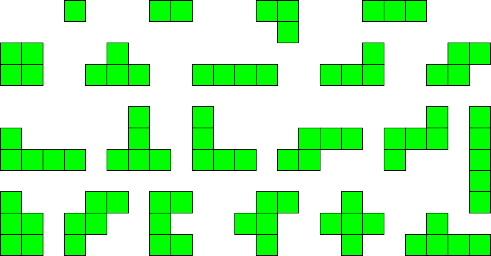

# Blokus

Python implementation of Blokus.

```bash
$ python3 main.py
```

## Rules

Blokus is played on a 20 x 20 square board, for a total of 400 square tiles.

There are a total of 84 game tiles, which breaks down to 21 shapes each in 4 colors: blue, yellow, red, green.

The game is played with 4 players, each representing one of the four colors. Each player can only the shapes that matches the color that they are representing.

The 21 shapes are based on free polyominoes of 1-5 squares (1 monomino, 1 domino, 2 trominoes/triominoes, 5 tetrominoes, and 12 pentominoes).



Order of play goes in: `blue`, `yellow`, `red`, `green`.

The first piece played of each color needs to be placed in one of the board's four corners.

Each new piece played must be placed so that it touches at least one piece of the same color, with only corner-to-corner contact allowed - edges cannot touch.

Edge-to-edge contact is only allowed between pieces of different colors.

When a player cannot place a piece, they have to pass the turn.

The game ends when no player can place a piece anymore.

Scoring is based on the number of squares in each player's pieces played on the game board. The player with the highest score wins.

For more, see:

- [Wikipedia](https://en.wikipedia.org/wiki/Blokus)
- [YouTube video](https://www.youtube.com/watch?v=4HLIw4Imhmw)
